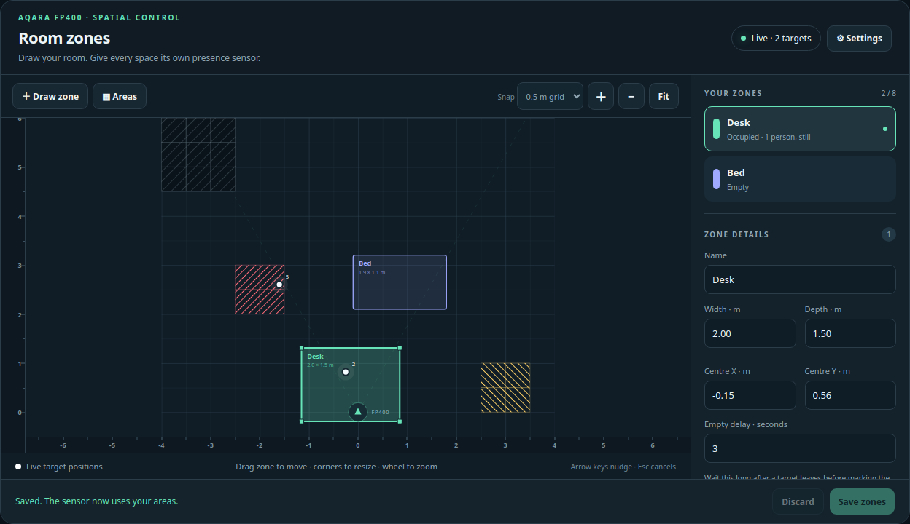

# Aqara FP400 Zone Card

[](https://hacs.xyz/docs/faq/custom_repositories/)
[](https://github.com/bobtekkk/aqara-fp400-zone-card/actions/workflows/validate.yml)
[](LICENSE)
[](https://buymeacoffee.com/bobtekkk)

Draw presence zones, doorways and "ghost" spots for the **Aqara FP400** spatial sensor on **Zigbee2MQTT**, and change its settings, straight from a Home Assistant dashboard. It aims to do everything the Aqara app does, without the app.



- **Up to 8 zones.** Draw rectangles on a live map; each one becomes its own occupancy sensor in Home Assistant, named after the zone (a zone called "Desk" gives you "Desk occupancy").
- **People count and movement per zone.** Each zone also tells you how many people are in it and whether they are moving or still, and fires enter/leave events.
- **Areas, like in the Aqara app.** Paint and erase the sensor's own areas: **ignore spots** (fake targets from a curtain, fan or TV), **doorways** (where people come and go) and **outside room** (behind a wall or a window).
- **Ghost targets.** Click a dot on the map to make the sensor forget it, or to turn its spot into an ignore spot.
- **Sensor settings.** Sensitivity, empty delay, approach distance, AI features, mounting and room learning, in one panel.
- **Movement events.** Enter, leave, approach, away and left/right events from the sensor, ready for automations.
- **Live map.** See tracked people move, with metre rulers. Pan, zoom and snap to a 0.5 m or 0.1 m grid.
- **Safe editing.** Nothing changes until you press Save, and the card only says "Saved" once the sensor confirms it.

**No Matter or Thread hardware needed.** Everything runs over Zigbee, on the Zigbee coordinator you already use with Zigbee2MQTT. No Thread border router, no Matter controller, no Aqara hub.

> Already using the FP400 over Matter instead? See [RAR/ha-aqara-fp400](https://github.com/RAR/ha-aqara-fp400).

## How it fits together

| Part | What it does | How you install it |
|---|---|---|
| `z2m/aqara-fp400.mjs` | Zigbee2MQTT converter: reads the FP400's position reports, runs the zones, writes areas and settings to the sensor | Copy one file (HACS cannot install Zigbee2MQTT converters) |
| `fp400-zone-card.js` | The dashboard editor | HACS |

## Requirements

- An Aqara FP400 paired to **Zigbee2MQTT 2.x** (tested with 2.14.1) through your existing Zigbee coordinator. No Thread or Matter hardware.
- Home Assistant with the MQTT integration and [HACS](https://hacs.xyz)

## Install

### 1. Converter (Zigbee2MQTT)

1. Download [`z2m/aqara-fp400.mjs`](z2m/aqara-fp400.mjs).
2. Put it in the `external_converters` folder next to Zigbee2MQTT's `configuration.yaml` (create the folder if it does not exist).
   With the Home Assistant add-on that is the add-on's data folder, by default `/config/zigbee2mqtt/external_converters/`.
3. Restart Zigbee2MQTT.
4. Check that Home Assistant now has entities like `text.<your_fp400>_software_zone_1_config`.

Use only one FP400 converter at a time. If Zigbee2MQTT later supports the FP400 natively, this file still takes priority until you remove it.

**Updating:** replace the file with the new version and restart Zigbee2MQTT. The card tells you when a feature needs the newer converter.

### 2. Card (HACS)

1. In HACS, open the ⋮ menu → **Custom repositories**, add `https://github.com/bobtekkk/aqara-fp400-zone-card` with type **Dashboard**.
2. Search for **Aqara FP400 Zone Card** in HACS and download it.
3. Reload your browser.

<details>
<summary>Without HACS</summary>

Copy `dist/fp400-zone-card.js` to `/config/www/`, then add `/local/fp400-zone-card.js` as a **JavaScript module** under Settings → Dashboards → ⋮ → Resources.
</details>

## Add it to a dashboard

The editor needs room, so give it a view of its own:

1. Edit your dashboard and add a view with view type **Panel (single card)**.
2. Add a card and search for **Aqara FP400 Zone Card**. It finds your FP400 by itself.

Or in YAML:

```yaml
type: custom:fp400-zone-card
device: living_room_fp400 # optional
```

`device` is the start of your FP400's entity IDs, the part before `_software_zone_1_config`. You only need it when you have more than one FP400.

## Using it

- **Draw zone**: drag on the map, name it in the sidebar, press **Save zones**.
- **Areas**: pick a type, then drag on the map. **Paint** adds 0.5 m cells, **Erase** removes them. Click a dashed shape to undo it, press **Save areas** to send everything to the sensor. **Cancel areas** (or Esc) drops all unsaved area edits. **Clear all** also waits for Save and can be undone.
  - **Ignore spot** (red): the sensor ignores movement there. Use it for a fan, a curtain or a TV.
  - **Doorway** (yellow): where people walk in and out; the sensor picks them up and lets them go faster.
  - **Outside room** (grey): behind a wall, a window or in the next room; the sensor stops watching those cells.
- **A dot you don't trust**: click it. **Forget this target** makes the sensor drop it (a real person comes back within seconds). **Ignore this spot** adds a 1 × 1 m ignore spot around it, for you to save.
- **⚙ Settings** (top right) changes the sensor's settings. They apply right away.
- Drag empty space to pan, use the mouse wheel to zoom, drag a zone to move it and its corners to resize it. Arrow keys nudge the selected zone.
- **Discard** throws away everything you have not saved.

### Every zone becomes a sensor

When you save a zone, Home Assistant gets a sensor named after it: a zone called **Desk** shows up as **Desk occupancy**. It turns on while someone is in that zone, so you can use it in automations and dashboards like any motion sensor. To find it, search for the zone's name under Settings → Devices & services → Entities.

| Entity | Name in Home Assistant | Meaning |
|---|---|---|
| `binary_sensor.<fp400>_software_zone_N_occupancy` | Desk occupancy | Someone is in the zone. Unknown while position data is missing or stale. |
| `sensor.<fp400>_software_zone_N_count` | Desk people | How many people are in the zone. |
| `sensor.<fp400>_software_zone_N_activity` | Desk activity | `moving` or `still`; unknown when the zone is empty. |
| `binary_sensor.<fp400>_software_zone_N_available` | Desk tracking available | The zone has fresh, complete position data. |
| `text.<fp400>_software_zone_N_config` | Desk zone configuration | The zone rectangle as JSON (what the card edits). |

N is the zone's number, shown next to **Zone details** in the card. The entity ID never changes, so automations keep working when you rename or move a zone. The naming needs a Home Assistant admin; for other users the sensors keep their default names, like `<fp400> Software zone 1 occupancy`. Deleting a zone gives the sensors their default names back.

### Events for automations

The FP400's action entity (`event.<fp400>_action`, plus a device trigger in the automation editor) fires:

| Event | When |
|---|---|
| `software_zone_N_enter` / `software_zone_N_leave` | Someone walks into or out of zone N. |
| `enter` / `leave` | Someone enters or leaves the room. |
| `approach` / `away` | Someone comes close to the sensor or walks away (distance set by **Approach distance**). |
| `left_in`, `left_out`, `right_in`, `right_out` | Sideways movement, when **Movement events** is set to **Left and right**. |

## Good to know

- Positions are in centimetres from the sensor: x is left/right, y is the distance in front of it. Walk along a new zone's edges once to check it.
- Zones are computed in Zigbee2MQTT from the sensor's position reports. They are saved in Zigbee2MQTT's device database and survive restarts.
- Areas are 0.5 m cells written to the sensor's own memory, like the Aqara app does. Their left/right orientation follows the check against the device made by [RAR/ha-aqara-fp400](https://github.com/RAR/ha-aqara-fp400). If an ignore spot does not hide a ghost, please open an issue.
- Painting **Outside room** cells replaces the converter's simple `detection_depth` setting (which cuts the room off at one distance); clear them to use it again.
- The converter re-reads the areas every 5 minutes, so the card also shows changes made elsewhere.
- Ember (EZSP) coordinators may cut long reports with several people in them; Z-Stack coordinators are not affected.
- Everything in the settings panel is also a normal Home Assistant entity (select, number, switch, button) on the FP400 device page.

## Development

```sh
npm ci --ignore-scripts
npm test      # unit tests
npm run e2e   # drives the card in a browser with real mouse input
```

`npm run e2e` needs Playwright's Chromium once: `npx playwright-core install chromium`. `test/preview.html` runs the card against a simulated sensor; serve the repository folder with any static web server to try it.

## Support

If this saved you an Aqara hub or a few evenings of fiddling, you can buy me a coffee:

<a href="https://buymeacoffee.com/bobtekkk"></a>

## Credits

- The converter builds on the community FP400 converter by **jcastro** in [Zigbee2MQTT issue #33146](https://github.com/Koenkk/zigbee2mqtt/issues/33146).
- Grid orientation from [RAR/ha-aqara-fp400](https://github.com/RAR/ha-aqara-fp400).
- Not affiliated with Aqara.

## License

[MIT](LICENSE)
